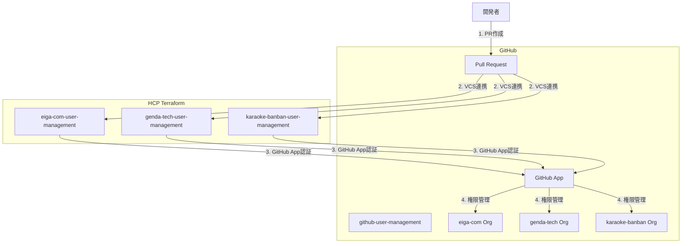

## はじめに
株式会社GENDAでSRE/インフラエンジニアをしています、入社6ヶ月目の布田です。弊社ではSRE/インフラとしてTerraformによるGitHub管理を導入しました。GitHubのメンバーをTerraform で管理するのはよくあることかもしれません。この記事では以下をお伝えしたいと思います。
- なぜGitHubで管理するのか
- マルチOrganization環境でのHCP Terraform との連携
- その他Tips

弊社には多くのプロダクトがあります。また、複数のOrgも持っています。ワークフローとしてはSlackから申請してSREがそれを確認して設定するという流れを撮っていました。台帳で管理していたので名前とアカウントが一致しないということもありません。ただ、「変更を追いにくい」という点は課題だと感じていました。背景としてまずM&Aをする会社であり、今後スケール指定国あたりSREが作業するだけでは限界がくることを想定し、利用者から申請ができるようにするという点もあります。これにより、スケールがしやすいという点があります。これが狙いです。このあたりの話をしてきます。


ちなみに、この記事は、GENDA Advent Calendar 2025 シリーズ2 Day12 の記事です。他の記事も是非呼んで頂ければと思います！
https://qiita.com/advent-calendar/2025/genda


「すみません、このリポジトリへのアクセス権限をください」

こんなSlackメッセージ、毎日何件届いていますか？

私たちの組織では、複数のGitHub Organizationを運用しており、メンバーの追加・削除、チームの作成、リポジトリへのアクセス権限付与を日常的に行っています。しかし、これらを手作業で管理していた頃は、以下のような課題に悩まされていました：

### 抱えていた課題

**1. 管理の属人化**
- 特定の管理者しか操作方法を知らない
- 管理者が休暇中や不在時は対応できない
- 新しい管理者へのナレッジ共有が困難

**2. トレーサビリティの欠如**
- 誰が、いつ、なぜ権限を変更したのか追跡できない
- 「この人、なぜこのリポジトリにアクセスできるんだっけ？」が分からない
- 監査対応時に履歴を辿れない

**3. 依頼対応の非効率さ**
- Slackでの口頭依頼 → 管理者が手作業で設定
- 管理者の手が空くまで待機（平均2日）
- 設定内容の口頭説明によるミスコミュニケーション

**4. セキュリティリスク**
- 手作業による設定ミス
- 権限の付与忘れ・削除忘れ
- 過剰な権限付与（「とりあえずAdmin」）

### 解決策: Terraform + HCP Terraformによる管理

本記事では、これらの課題をTerraform + HCP Terraformで解決し、**PRベースの権限管理フロー**を実現した事例を紹介します。

技術的な実装だけでなく、**組織にもたらした変化**や**運用してみて分かった効果**についても詳しく解説します。

### 実現したこと

- ✅ PRベースの権限管理フロー（依頼→レビュー→承認→適用）
- ✅ 変更履歴の完全な追跡（Git履歴 + HCP Terraform実行ログ）
- ✅ セルフサービス化による依頼対応の高速化
- ✅ 権限の可視化とレビュー文化の醸成
- ✅ Organization毎のWorkspace分離による安全な管理

## 目次

1. [なぜTerraform化したのか](#なぜterraform化したのか)
2. [アーキテクチャ概要](#アーキテクチャ概要)
3. [設計のポイント](#設計のポイント)
4. [実装](#実装)
   - [HCP Terraformのセットアップ](#hcp-terraformのセットアップ)
   - [GitHub App認証の設定](#github-app認証の設定)
   - [Workspace構成](#workspace構成)
   - [チーム設計と実装](#チーム設計と実装)
5. [運用フロー](#運用フロー)
6. [実装時のハマりポイント](#実装時のハマりポイント)
7. [運用してみて分かったこと](#運用してみて分かったこと)
8. [組織にもたらした変化](#組織にもたらした変化)
9. [新規Organizationの追加手順](#新規organizationの追加手順)
10. [まとめ](#まとめ)

---

## なぜTerraform化したのか

手作業での管理に限界を感じ、Terraform化を決断した理由は大きく3つあります。

### 1. トレーサビリティの確保

**課題**: 
- 「この人、いつからこのリポジトリにアクセスできるようになったんだっけ？」
- 「誰が承認して権限を付与したの？」
- 監査対応時に履歴を辿れない

**解決**:
- 全ての変更がGit履歴として記録される
- PRのレビュー履歴で「誰が承認したか」が明確
- HCP Terraformの実行ログで「いつ適用されたか」が分かる

### 2. セルフサービス化による効率化

**課題**:
- 管理者への依頼 → 管理者の手が空くまで待機 → 手作業で設定
- 平均2日かかる対応時間
- 管理者の作業時間: 週5時間

**解決**:
- 開発者が自分でPRを作成できる
- レビュアーが非同期で確認・承認
- マージ後は自動でPlan → 手動Apply
- 対応時間: 即日（PRマージ後すぐ）

### 3. 権限の可視化とレビュー文化

**課題**:
- 誰がどのリポジトリにアクセスできるか不透明
- 「とりあえずAdmin権限」の付与
- 退職者の権限削除漏れ

**解決**:
- コードで権限設計が可視化される
- PRレビューで「なぜこの権限が必要？」を議論できる
- 過剰な権限付与の抑止
- 定期的なコードレビューで棚卸しが容易

### なぜHCP Terraformなのか

Terraform Cloudではなく、HCP Terraformを選んだ理由：

- **Organization毎のWorkspace分離**: 複数のGitHub Orgを安全に管理
- **VCS連携**: PRマージで自動Plan実行
- **実行ログの永続化**: 監査対応に必要な履歴が残る
- **チーム管理**: Workspace単位でアクセス制御が可能

---

## アーキテクチャ概要

### システム構成図



### ディレクトリ構成

```
github-user-management/
├── shared/
│   └── modules/
│       └── team/              # チーム管理モジュール
├── eiga-com/                  # Organization毎にディレクトリ分離
│   ├── members.tf             # メンバー一覧
│   ├── developer_teams.tf     # 正社員チーム
│   ├── product_teams.tf       # プロダクト別チーム
│   └── versions.tf
├── genda-tech/
│   ├── members.tf
│   └── ...
└── karaoke-banban/
    ├── members.tf
    └── ...
```

---

## 設計のポイント

実装にあたって、特に重視した設計ポイントを紹介します。

### 1. Workspace分離の判断基準

**Organization毎にWorkspaceを分ける**という設計にしました。

#### なぜ分けるのか？

- **影響範囲の分離**: 1つのOrgへの変更が他のOrgに影響しない
- **並行実行**: 複数のOrgへの変更を同時に適用可能
- **権限管理**: Workspace単位でアクセス制御が可能
- **明確性**: どのOrgに変更が入るか一目瞭然

#### Working Directoryの活用

各Workspaceで`Working Directory`を設定することで、該当ディレクトリ配下のTerraformコードのみが実行されます。

```
eiga-com-user-management → Working Directory: eiga-com/
genda-tech-user-management → Working Directory: genda-tech/
karaoke-banban-user-management → Working Directory: karaoke-banban/
```

これにより、1つのリポジトリで複数のOrganizationを管理しつつ、安全に運用できます。

### 2. GitHub App vs PAT の選択

Personal Access Token（PAT）ではなく、**GitHub App**を採用しました。

| 項目 | PAT | GitHub App |
|------|-----|------------|
| 認証の紐付け | 個人アカウント | Organization |
| 有効期限 | 最大1年（要ローテーション） | なし |
| 権限の細分化 | 粗い | 細かく設定可能 |
| 監査ログ | 個人の操作として記録 | App経由として記録 |
| 管理者退職時 | トークン無効化 | 影響なし |

**GitHub Appのメリット**:
- ✅ ユーザーに紐づかない、Organization専用の認証
- ✅ 必要最小限の権限のみ付与
- ✅ 定期的なローテーション不要
- ✅ 監査ログが明確

### 3. チームベース設計の意図

GitHub Organizationの**Base Permission**は設定せず、全てのアクセス権限を**Team経由**で管理します。

#### なぜTeamベースなのか？

**Base Permissionを設定した場合の問題**:
- Organization全体に一律の権限が付与される
- 業務委託やインターンにも同じ権限が付与されてしまう
- 最小権限の原則に反する

**Teamベースのメリット**:
- ✅ **最小権限の原則**: 必要な人に、必要なリポジトリへの、必要な権限のみ付与
- ✅ **柔軟性**: 雇用形態や役割に応じた細かい権限設計が可能
- ✅ **可視性**: 誰がどのリポジトリにアクセスできるか明確

#### チーム構成パターン

私たちは以下の3パターンでチームを設計しています：

1. **正社員向け**: 全リポジトリへのWrite権限
2. **業務委託・インターン向け**: 特定リポジトリのみのWrite権限
3. **管理者向け**: 特定リポジトリへのAdmin権限（Settings変更、GitHub App管理等）

---

## 実装

ここからは具体的な実装方法を解説します。

## HCP Terraformのセットアップ

### 1. Organizationの作成

HCP Terraformで新規Organizationを作成します。

### 2. Workspaceの作成

Organization毎にWorkspaceを作成します。これにより、以下のメリットがあります：

- **影響範囲の分離**: 1つのOrgへの変更が他のOrgに影響しない
- **並行実行**: 複数のOrgへの変更を同時に適用可能
- **権限管理**: Workspace単位でアクセス制御が可能

#### Workspace設定例

| 項目 | 設定値 |
|------|--------|
| Workspace名 | `eiga-com-user-management` |
| Working Directory | `eiga-com` |
| VCS Branch | `main` |
| Auto Apply | `false`（手動承認） |

**重要**: `Working Directory`を各Organization用ディレクトリに設定することで、該当ディレクトリ配下のTerraformコードのみが実行されます。

### 3. VCS連携の設定

GitHub Repositoryと連携します：

1. HCP Terraform → Settings → Version Control
2. GitHub.comを選択
3. `genda-tech/github-user-management`を指定
4. Working Directoryを設定（例: `eiga-com`）

---

## GitHub App認証の設定

Personal Access Token（PAT）ではなく、GitHub Appを使用する理由：

- ✅ **セキュリティ**: ユーザーに紐づかない、Organization専用の認証
- ✅ **権限の細分化**: 必要最小限の権限のみ付与
- ✅ **監査ログ**: GitHub App経由の操作として記録
- ✅ **有効期限なし**: PATのような定期的なローテーション不要

### GitHub Appの作成手順

#### 1. GitHub Appの作成

Organization Settings → Developer settings → GitHub Apps → New GitHub App

**必要な権限**:
- Repository permissions:
  - Administration: Read & Write
  - Metadata: Read-only
- Organization permissions:
  - Members: Read & Write
  - Administration: Read & Write

#### 2. Private Keyの生成

GitHub App設定画面で「Generate a private key」をクリックし、`.pem`ファイルをダウンロード。

#### 3. HCP Terraform環境変数の設定

各Workspaceで以下の環境変数を設定：

| 変数名 | 値 | Sensitive |
|--------|-----|-----------|
| `GITHUB_APP_ID` | GitHub AppのID | No |
| `GITHUB_APP_INSTALLATION_ID` | InstallationのID | No |
| `GITHUB_APP_PEM_FILE` | Private Keyの内容 | **Yes** |
| `GITHUB_OWNER` | Organization名（例: `eiga-com`） | No |

#### 4. Terraform Provider設定

```hcl:versions.tf
terraform {
  required_version = ">= 1.0"
  
  required_providers {
    github = {
      source  = "integrations/github"
      version = "~> 6.0"
    }
  }
  
  cloud {
    organization = "your-org-name"
    workspaces {
      name = "eiga-com-user-management"
    }
  }
}

provider "github" {
  owner = var.github_owner
  
  app_auth {
    id              = var.github_app_id
    installation_id = var.github_app_installation_id
    pem_file        = var.github_app_pem_file
  }
}
```

---

## Workspace構成

実際のWorkspace構成は以下の通りです：

各Workspaceは独立して動作し、以下の状態を持ちます：

- **Applied**: 最新の変更が適用済み
- **Planned and finished**: Plan実行済み、Apply待ち
- **No changes**: 変更なし

### Workspace分離のメリット

1. **安全性**: 1つのOrgでの失敗が他に波及しない
2. **並行性**: 複数PRを同時に処理可能
3. **明確性**: どのOrgに変更が入るか一目瞭然

---

## チーム設計と実装

### チーム設計の基本方針

GitHub Organizationの**Base Permission**は設定せず、全てのアクセス権限を**Team経由**で管理します。

#### なぜTeamベースなのか？

- ✅ **最小権限の原則**: 必要な人に、必要なリポジトリへの、必要な権限のみ付与
- ✅ **柔軟性**: 雇用形態や役割に応じた細かい権限設計が可能
- ✅ **可視性**: 誰がどのリポジトリにアクセスできるか明確

### チーム構成パターン

#### 1. 正社員向け: 全リポジトリアクセスチーム

```hcl:developer_teams.tf
module "genda_developer" {
  source = "../shared/modules/team"
  
  team_name        = "genda-developer"
  team_description = "GENDA正社員開発者"
  
  members_by_role = {
    maintainer = ["tech-lead"]
    member = [
      "developer1",
      "developer2",
      "developer3"
    ]
  }
  
  # 全リポジトリにWrite権限
  repositories = {
    "repo-a" = { permission = "push" }
    "repo-b" = { permission = "push" }
    "repo-c" = { permission = "push" }
  }
}
```

#### 2. 業務委託・インターン向け: リポジトリ限定チーム

```hcl:product_teams.tf
module "product_x_collaborators" {
  source = "../shared/modules/team"
  
  team_name        = "product-x-collaborators"
  team_description = "プロダクトX 業務委託メンバー"
  
  members_by_role = {
    maintainer = []
    member = [
      "contractor1",
      "intern1"
    ]
  }
  
  # 特定リポジトリのみアクセス可能
  repositories = {
    "product-x-frontend" = { permission = "push" }
    "product-x-backend"  = { permission = "push" }
  }
}
```

#### 3. 管理者チーム: Admin権限が必要な場合

```hcl:product_teams.tf
module "product_x_admins" {
  source = "../shared/modules/team"
  
  team_name        = "product-x-admins"
  team_description = "プロダクトX 管理者（Settings変更、GitHub App管理等）"
  
  members_by_role = {
    maintainer = ["product-manager"]
    member     = []
  }
  
  repositories = {
    "product-x-frontend" = { permission = "admin" }
    "product-x-backend"  = { permission = "admin" }
  }
}
```

### チーム管理モジュール

共通モジュールで一貫性を保ちます：

```hcl:shared/modules/team/main.tf
resource "github_team" "this" {
  name        = var.team_name
  description = var.team_description
  privacy     = "closed"
}

resource "github_team_membership" "maintainers" {
  for_each = toset(var.members_by_role.maintainer)
  
  team_id  = github_team.this.id
  username = each.value
  role     = "maintainer"
}

resource "github_team_membership" "members" {
  for_each = toset(var.members_by_role.member)
  
  team_id  = github_team.this.id
  username = each.value
  role     = "member"
}

resource "github_team_repository" "this" {
  for_each = var.repositories
  
  team_id    = github_team.this.id
  repository = each.key
  permission = each.value.permission
}
```

### メンバー管理

全メンバーを一元管理：

```hcl:members.tf
locals {
  all_members = {
    "developer1" = {
      role            = "member"
      email           = "developer1@genda.jp"
      name_kanji      = "山田 太郎"
      name_alphabet   = "Taro Yamada"
      employment_type = "正社員"
    }
    
    "contractor1" = {
      role            = "member"
      email           = "contractor1@example.com"
      name_kanji      = "佐藤 花子"
      name_alphabet   = "Hanako Sato"
      employment_type = "業務委託"
    }
  }
}

resource "github_membership" "members" {
  for_each = local.all_members
  
  username = each.key
  role     = each.value.role
}
```

---

## 運用フロー

### 1. メンバー追加の依頼

開発者がPRを作成：

```diff:eiga-com/members.tf
 locals {
   all_members = {
     # 既存メンバー...
+    
+    "new-developer" = {
+      role            = "member"
+      email           = "new-developer@genda.jp"
+      name_kanji      = "新人 太郎"
+      name_alphabet   = "Taro Shinjin"
+      employment_type = "正社員"
+    }
   }
 }
```

```diff:eiga-com/developer_teams.tf
 module "genda_developer" {
   # ...
   members_by_role = {
     maintainer = []
     member = [
+      "new-developer",
       "existing-developer1",
       "existing-developer2"
     ]
   }
 }
```

**PRテンプレート例**:

```markdown
## 変更内容
- 新人 太郎さん（new-developer）をgenda-developerチームに追加

## 変更理由
- 2025年12月入社の新入社員
- 全リポジトリへのWrite権限が必要

## チェックリスト
- [x] members.tfに追加
- [x] 適切なチームに所属
- [x] 雇用形態を正しく記載
```

### 2. レビュー

**レビュアー要件**:
- SREチーム（CODEOWNERS自動指定）
- マネージャーまたはリード（メンバーがPR作成時）

レビュー観点：
- メンバー情報の正確性
- 適切なチームへの所属
- 権限レベルの妥当性

### 3. HCP TerraformでのPlan確認

PRマージ前に、HCP Terraform上でPlan結果を確認：

```
Terraform will perform the following actions:

  # github_membership.members["new-developer"] will be created
  + resource "github_membership" "members" {
      + etag     = (known after apply)
      + id       = (known after apply)
      + role     = "member"
      + username = "new-developer"
    }

  # github_team_membership.members["new-developer"] will be created
  + resource "github_team_membership" "members" {
      + etag     = (known after apply)
      + id       = (known after apply)
      + role     = "member"
      + team_id  = "12345678"
      + username = "new-developer"
    }

Plan: 2 to add, 0 to change, 0 to destroy.
```

### 4. マージとApply

1. PRをマージ
2. HCP TerraformでPlanが自動実行
3. Plan結果を確認
4. 手動でApplyを実行（Auto Applyは無効化推奨）

### 5. 完了通知

Apply完了後、PRにコメントが自動投稿されます（HCP Terraform連携）。

---

## 実装時のハマりポイント

実装時に詰まったポイントと解決方法を共有します。

### 1. PEMファイルの1行化

**問題**:
GitHub AppのPrivate Keyは複数行のPEMファイルですが、HCP Terraformの環境変数には1行で設定する必要があります。

**解決**:
各行末に`\n`を追加して改行を削除します。

```bash
# コマンドで一発変換
cat private-key.pem | sed 's/$/\\n/' | tr -d '\n'
```

または手動で：
1. PEMファイルを開く
2. 各行の末尾に`\n`を追加
3. 全ての改行を削除して1行にする

**注意**: `\n`は2文字（バックスラッシュ + n）として扱います。

### 2. Working Directoryの設定ミス

**問題**:
Working Directoryを設定し忘れると、リポジトリ全体のTerraformコードが実行され、意図しないOrganizationに変更が適用されてしまいます。

**解決**:
- Workspace作成時に必ず`Working Directory`を設定
- 設定値: `{org}/`（例: `eiga-com/`）
- 末尾のスラッシュを忘れずに

**確認方法**:
Workspace → Settings → General → Terraform Working Directoryで確認できます。

### 3. 既存リソースのimport

**問題**:
既にGitHub上に存在するメンバーやチームをTerraform管理下に置く際、`terraform import`が必要です。

**解決**:
```bash
# メンバーのimport
terraform import 'github_membership.members["username"]' org:username

# チームのimport
terraform import 'github_team.team_name' 12345678

# チームメンバーシップのimport
terraform import 'github_team_membership.members["username"]' 12345678:username
```

**Tips**:
- 大量のリソースがある場合は、スクリプトで一括import
- `terraform plan`で差分がないことを確認してからApply

### 4. Auto Applyの罠

**問題**:
最初は「Auto Apply便利そう」と思ってONにしましたが、意図しない変更が自動適用されて怖い思いをしました。

**解決**:
- **Auto ApplyはOFF推奨**
- Plan結果を必ず確認してから手動でApply
- 特に削除操作（`destroy`）は慎重に

**運用ルール**:
1. PRマージ後、HCP TerraformでPlanが自動実行される
2. Plan結果をSlackで確認
3. 問題なければ手動でApply

---

## 運用してみて分かったこと

実際に運用してみて分かった効果と気づきを紹介します。

### 定量的な効果

| 項目 | Before | After |
|------|--------|-------|
| 依頼対応時間 | 平均2日 | 即日（PRマージ後すぐ） |
| 管理者の作業時間 | 週5時間 | 週1時間 |
| 権限付与ミス | 月2-3件 | 0件 |
| 権限削除漏れ | 年数件 | 0件 |

### 定性的な効果

#### 1. PRレビューで権限設計の議論が生まれた

**Before**:
- 「とりあえずAdmin権限ください」
- 管理者が深く考えずに付与

**After**:
- PR上で「なぜAdmin権限が必要？」と質問
- 「Settings変更のため」「GitHub App管理のため」など理由が明確に
- 本当に必要な権限のみ付与される

**具体例**:
```markdown
# PRコメントの例
> Admin権限が必要とのことですが、具体的にどの操作で必要ですか？
> Secretsの設定だけであれば、一時的にAdmin付与 → 作業後に削除でも良いかもしれません。

→ 結果: 継続的なAdmin権限ではなく、作業時のみの一時付与に変更
```

#### 2. 開発者が権限について考えるようになった

**Before**:
- 「権限ください」だけの依頼
- 何の権限が必要か意識していない

**After**:
- PRを作成する際に、どのチームに所属すべきか考える
- 「このリポジトリだけアクセスできればいい」という意識
- 最小権限の原則が浸透

#### 3. オンボーディング/オフボーディングが楽になった

**Before**:
- 入社時: 管理者が手作業で各リポジトリに追加
- 退職時: 削除漏れのリスク

**After**:
- 入社時: PRで一括追加、レビュー後にApply
- 退職時: PRで一括削除、Git履歴に記録が残る

**具体例**:
```hcl
# 退職者の削除PR
- "retired-member" = {
-   role            = "member"
-   email           = "retired@example.com"
-   name_kanji      = "退職 太郎"
-   name_alphabet   = "Taro Taishoku"
-   employment_type = "正社員"
- }
```

このPRをマージするだけで、全てのチームから削除され、Organization membershipも削除されます。

#### 4. 監査対応が容易になった

**Before**:
- 「この人、いつからこの権限持ってるの？」に答えられない
- スプレッドシートと実態が乖離

**After**:
- Git履歴で「いつ、誰が、なぜ」が全て分かる
- HCP Terraformの実行ログで適用日時も記録
- 監査時に必要な情報がすぐに提示できる

#### 内部監査での活用例

実際に内部監査で求められた項目と、Terraform管理によって対応できた例を紹介します。

**監査項目1: アクセス権限の棚卸し**

```
Q: 「現在、各リポジトリに誰がアクセスできるか一覧で提示してください」
A: members.tfとteams.tfを提示するだけで完結
   - 誰がどのチームに所属しているか
   - 各チームがどのリポジトリにアクセスできるか
   - 権限レベル（Read/Write/Admin）
   全てコードで可視化されている
```

**監査項目2: 権限変更の履歴**

```
Q: 「過去1年間の権限変更履歴を提示してください」
A: Git履歴を抽出するだけ
   $ git log --since="1 year ago" --oneline -- */members.tf */teams.tf
   
   各コミットで以下が分かる：
   - 変更日時
   - 変更者（PRの作成者）
   - 承認者（PRのレビュアー）
   - 変更理由（PRの説明文）
   - 変更内容（diff）
```

**監査項目3: 過剰な権限付与の確認**

```
Q: 「Admin権限を持つユーザーとその理由を説明してください」
A: teams.tfでAdmin権限を持つチームを検索
   
   # Admin権限を持つチームの例
   module "product_x_admins" {
     team_name = "product-x-admins"
     team_description = "プロダクトX 管理者（Settings変更、GitHub App管理等）"
     
     repositories = {
       "product-x-frontend" = { permission = "admin" }
     }
   }
   
   → team_descriptionに理由が記載されている
   → PRの履歴で「なぜAdmin権限が必要か」の議論も追跡可能
```

**監査項目4: 退職者の権限削除確認**

```
Q: 「退職者の権限が適切に削除されているか確認してください」
A: Git履歴で退職者の削除PRを検索
   
   $ git log --grep="退職" --oneline
   
   各PRで以下が確認できる：
   - 削除日時
   - 削除実行者
   - 削除承認者
   - HCP Terraformの実行ログで実際に適用されたことを確認
```

**監査項目5: 職務分離の確認**

```
Q: 「権限付与の申請者と承認者が分離されているか確認してください」
A: PRのレビュー履歴で確認
   
   - 申請者: PRの作成者
   - 承認者: PRのレビュアー（CODEOWNERSでSREチームが必須）
   - 適用者: HCP Terraformの実行ログで記録
   
   → 申請・承認・適用の3段階で職務分離が実現されている
```

#### 監査対応の工数削減

**Before**:
- 監査依頼 → 手作業で情報収集 → Excel整理 → 提出
- 対応時間: 2-3日

**After**:
- 監査依頼 → Git履歴とコードを提示 → 完了
- 対応時間: 1-2時間

**具体的な削減例**:
```bash
# アクセス権限の棚卸し（全メンバーの一覧）
cat */members.tf | grep -A 5 '".*" = {' > audit_members.txt

# 過去1年の権限変更履歴
git log --since="1 year ago" --pretty=format:"%h %ad %s" --date=short \
  -- */members.tf */teams.tf > audit_changes.txt

# Admin権限を持つチーム一覧
grep -r "permission = \"admin\"" */teams.tf > audit_admin_teams.txt
```

これらのコマンドで監査に必要な情報が数分で抽出できます。

---

## 組織にもたらした変化

技術的な実装だけでなく、組織文化にも変化がありました。

### 1. 権限管理の「見える化」

**変化**:
- 誰がどのリポジトリにアクセスできるか、コードで一目瞭然
- 新メンバーも`members.tf`を見れば権限構成が理解できる
- 「なぜこの人がこのリポジトリにアクセスできるの？」がなくなった

**具体例**:
```hcl
# members.tfを見れば一目瞭然
locals {
  all_members = {
    "developer1" = {
      role            = "member"
      email           = "developer1@genda.jp"
      name_kanji      = "山田 太郎"
      name_alphabet   = "Taro Yamada"
      employment_type = "正社員"  # ← 雇用形態も記録
    }
  }
}
```

### 2. セルフサービス化の効果

**変化**:
- 開発者が自分でPRを作成できる
- 管理者への依頼待ちがなくなった
- 開発者のオーナーシップ向上

**開発者の声**:
> 「以前はSlackで依頼して2日待ちでしたが、今は自分でPR出してレビュー待ちだけ。圧倒的に早い」

**管理者の声**:
> 「週5時間かかっていた権限管理作業が週1時間に。PRレビューだけで済むので楽になった」

### 3. トレーサビリティの価値

**変化**:
- 全ての変更がGit履歴に記録される
- インシデント時の追跡が容易
- 監査対応がスムーズ

**実際のケース**:
```
Q: 「このリポジトリに誤ったコミットがあるが、誰がアクセスできる？」
A: Git履歴を確認 → 該当時期にアクセス権限を持っていたメンバーを特定
   → 迅速に原因調査
```

### 4. セキュリティ意識の向上

**変化**:
- PRレビューで過剰な権限付与を指摘できる
- 「最小権限の原則」が浸透
- 定期的なコードレビューで権限の棚卸しが容易

**具体例**:
- 業務委託メンバーに全リポジトリアクセスを付与しようとしたPR → レビューで指摘 → 必要なリポジトリのみに変更
- 退職者の権限削除漏れ → 定期的なコードレビューで発見 → 即座に削除

---

## 新規Organizationの追加手順

新しいGitHub Organizationを管理対象に追加する際の手順です。

### 1. GitHub Appの作成

対象のOrganizationでGitHub Appを作成します。

#### 設定項目

| 項目 | 設定値 |
|------|--------|
| GitHub App name | `terraform-user-management-{org}` |
| Homepage URL | `https://github.com/genda-tech/github-user-management` |
| Webhook | **無効化**（Activeのチェックを外す） |
| Permissions | Organization permissions → **Members: Read and Write** |

#### Private Keyの生成

1. GitHub App設定画面で「Generate a private key」をクリック
2. `.pem`ファイルをダウンロード
3. **重要**: このファイルは後でHCP Terraformに設定するため保管

#### Organizationへのインストール

GitHub App作成後、対象のOrganizationにインストールします。

### 2. HCP Terraform Workspaceの作成

#### Workspace作成

1. HCP Terraformにログイン
2. Project: `github-user-management`を選択
3. 新規Workspaceを作成
   - Name: `{org}-user-management`（例: `eiga-com-user-management`）

#### 環境変数の設定

Workspace → Variables → Add variableで以下を設定：

| 変数名 | 取得方法 | Sensitive |
|--------|----------|-----------|
| `GITHUB_APP_ID` | GitHub App設定ページ上部のApp ID | No |
| `GITHUB_APP_INSTALLATION_ID` | Install設定ページURLの末尾8桁 | No |
| `GITHUB_APP_PEM_FILE` | PEMファイルの内容を1行化（後述） | **Yes** |

**PEMファイルの1行化**:
```bash
# 各行末に\nを追加して改行を削除
cat private-key.pem | sed 's/$/\\n/' | tr -d '\n'
```

または手動で：
1. PEMファイルを開く
2. 各行の末尾に`\n`を追加
3. 全ての改行を削除して1行にする

#### VCS連携の設定

**Settings → General**:
- Execution Mode: Remote
- Apply Method: Manual apply（推奨）
- Terraform Working Directory: `{org}/`（例: `eiga-com/`）

**Settings → Version Control**:
- VCS Provider: GitHub.com
- Repository: `genda-tech/github-user-management`
- Branch: `main`
- Automatic Run Triggering: **有効**

これで、該当ディレクトリへの変更時のみこのWorkspaceが実行されます。

### 3. 初回実行

1. Workspaceで「Start new run」をクリック
2. Planが成功することを確認
3. 既存リソースがある場合は`terraform import`で取り込み

---

## 得られた効果

### 1. トレーサビリティの向上

**Before**: 
- Slackでの口頭依頼
- 誰が、いつ、なぜ変更したか不明

**After**:
- 全ての変更がGit履歴に記録
- PR上でレビュー履歴が残る
- HCP Terraformで実行ログが永続化

### 2. 依頼の簡易化

**Before**:
- 管理者にSlackで依頼
- 管理者の手が空くまで待機
- 設定内容の口頭説明

**After**:
- PRを作成するだけ
- レビュアーが非同期で確認
- コードで設定内容が明確

### 3. ミスの削減

**Before**:
- 手作業による設定ミス
- 権限の付与忘れ
- 削除忘れ

**After**:
- Terraformによる冪等性保証
- Plan結果での事前確認
- Dry-runによる安全性

### 4. 属人化の解消

**Before**:
- 管理者しか操作できない
- 管理者不在時は対応不可

**After**:
- 誰でもPRを作成可能
- レビュアーが複数人
- ドキュメント化されたプロセス

### 5. セキュリティの向上

**Before**:
- PATの定期ローテーション必要
- 個人アカウントに紐づく操作

**After**:
- GitHub Appによる認証
- Organization専用の権限
- 監査ログの充実

---

## まとめ

GitHub OrganizationをTerraform + HCP Terraformで管理することで、以下を実現しました：

### 技術的な成果

- ✅ **PRベースの透明性の高い運用フロー**
- ✅ **完全なトレーサビリティ**（Git + HCP Terraform）
- ✅ **Workspace分離による安全な管理**
- ✅ **GitHub Appによるセキュアな認証**
- ✅ **チームベースの柔軟な権限設計**

### 組織への影響

- ✅ **依頼対応時間**: 平均2日 → 即日
- ✅ **管理者の作業時間**: 週5時間 → 週1時間
- ✅ **権限付与ミス**: 月2-3件 → 0件
- ✅ **監査対応時間**: 2-3日 → 1-2時間
- ✅ **セキュリティ意識の向上**: PRレビューで過剰な権限付与を抑止
- ✅ **開発者のオーナーシップ向上**: 自分でPRを作成できる

### 特に価値があったこと

1. **権限管理の可視化**: コードで誰がどのリポジトリにアクセスできるか一目瞭然
2. **セルフサービス化**: 開発者が自分でPRを作成、管理者の負荷軽減
3. **トレーサビリティ**: 監査対応やインシデント調査が容易
4. **レビュー文化**: PRで権限設計を議論、最小権限の原則が浸透
5. **監査対応の効率化**: Git履歴とコードで監査に必要な情報を即座に提示

### 今後の展望

この仕組みは他のSaaS管理にも応用できます。実際に私たちは：

- **AWS IAM Identity Center**: 同様のパターンでマルチOrganization管理
- **その他のSaaS**: Terraform Providerがあるサービスへの横展開を検討中

**ポイント**:
- PRベースのレビューフロー
- HCP TerraformのWorkspace分離
- Git履歴による変更追跡

このパターンは、GitHub以外の管理にも適用できる汎用的なアプローチです。

### 最後に

「権限管理をコード化する」というと技術的な話に聞こえますが、実際には**組織文化の変革**でもありました。

- 開発者が権限について考えるようになった
- PRレビューで権限設計を議論する文化が生まれた
- セキュリティ意識が向上した

技術的な実装だけでなく、**組織にどんな変化をもたらすか**を意識することが、IaCの真の価値だと感じています。

同じような課題を抱えている組織の参考になれば幸いです。

---

## 参考リンク

- [Terraform GitHub Provider](https://registry.terraform.io/providers/integrations/github/latest/docs)
- [HCP Terraform Documentation](https://developer.hashicorp.com/terraform/cloud-docs)
- [GitHub Apps Documentation](https://docs.github.com/en/apps)
- [GitHub Organization管理リポジトリ（サンプル）](https://github.com/genda-tech/github-user-management)


