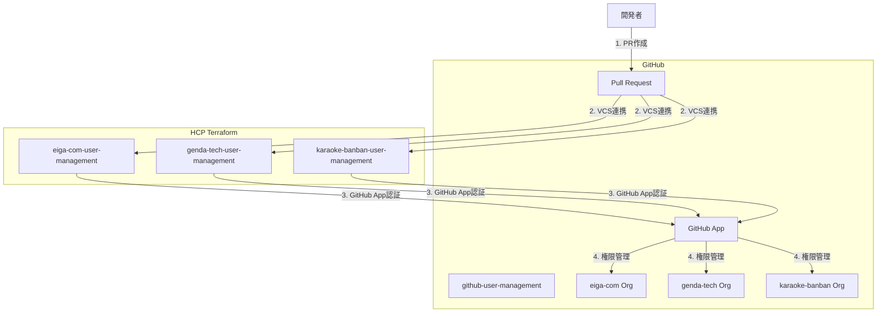

## はじめに

GitHub Organizationの管理、どうしていますか？

メンバーの追加・削除、チームの作成、リポジトリへのアクセス権限付与...これらを手作業で行うと、以下のような課題が発生します：

- **トレーサビリティの欠如**: 誰が、いつ、なぜ権限を変更したのか追跡できない
- **属人化**: 管理者しか操作方法を知らない
- **依頼の煩雑さ**: Slackでの口頭依頼、スプレッドシート管理など非効率
- **ミスのリスク**: 手作業による設定ミス、権限の付与忘れ

本記事では、これらの課題をTerraform + HCP Terraformで解決した事例を紹介します。

### 実現したこと

- ✅ PRベースの権限管理フロー（依頼→レビュー→承認→適用）
- ✅ 変更履歴の完全な追跡（Git履歴 + HCP Terraform実行ログ）
- ✅ Organization毎のWorkspace分離による安全な管理
- ✅ GitHub Appによるセキュアな認証
- ✅ チームベースのアクセス制御による柔軟な権限設計

## 目次

1. [アーキテクチャ概要](#アーキテクチャ概要)
2. [HCP Terraformのセットアップ](#hcp-terraformのセットアップ)
3. [GitHub App認証の設定](#github-app認証の設定)
4. [Workspace構成](#workspace構成)
5. [チーム設計と実装](#チーム設計と実装)
6. [運用フロー](#運用フロー)
7. [得られた効果](#得られた効果)

---

## アーキテクチャ概要

### システム構成図



### ディレクトリ構成

```
github-user-management/
├── shared/
│   └── modules/
│       └── team/              # チーム管理モジュール
├── eiga-com/                  # Organization毎にディレクトリ分離
│   ├── members.tf             # メンバー一覧
│   ├── developer_teams.tf     # 正社員チーム
│   ├── product_teams.tf       # プロダクト別チーム
│   └── versions.tf
├── genda-tech/
│   ├── members.tf
│   └── ...
└── karaoke-banban/
    ├── members.tf
    └── ...
```

---

## HCP Terraformのセットアップ

### 1. Organizationの作成

HCP Terraformで新規Organizationを作成します。

### 2. Workspaceの作成

Organization毎にWorkspaceを作成します。これにより、以下のメリットがあります：

- **影響範囲の分離**: 1つのOrgへの変更が他のOrgに影響しない
- **並行実行**: 複数のOrgへの変更を同時に適用可能
- **権限管理**: Workspace単位でアクセス制御が可能

#### Workspace設定例

| 項目 | 設定値 |
|------|--------|
| Workspace名 | `eiga-com-user-management` |
| Working Directory | `eiga-com` |
| VCS Branch | `main` |
| Auto Apply | `false`（手動承認） |

**重要**: `Working Directory`を各Organization用ディレクトリに設定することで、該当ディレクトリ配下のTerraformコードのみが実行されます。

### 3. VCS連携の設定

GitHub Repositoryと連携します：

1. HCP Terraform → Settings → Version Control
2. GitHub.comを選択
3. `genda-tech/github-user-management`を指定
4. Working Directoryを設定（例: `eiga-com`）

---

## GitHub App認証の設定

Personal Access Token（PAT）ではなく、GitHub Appを使用する理由：

- ✅ **セキュリティ**: ユーザーに紐づかない、Organization専用の認証
- ✅ **権限の細分化**: 必要最小限の権限のみ付与
- ✅ **監査ログ**: GitHub App経由の操作として記録
- ✅ **有効期限なし**: PATのような定期的なローテーション不要

### GitHub Appの作成手順

#### 1. GitHub Appの作成

Organization Settings → Developer settings → GitHub Apps → New GitHub App

**必要な権限**:
- Repository permissions:
  - Administration: Read & Write
  - Metadata: Read-only
- Organization permissions:
  - Members: Read & Write
  - Administration: Read & Write

#### 2. Private Keyの生成

GitHub App設定画面で「Generate a private key」をクリックし、`.pem`ファイルをダウンロード。

#### 3. HCP Terraform環境変数の設定

各Workspaceで以下の環境変数を設定：

| 変数名 | 値 | Sensitive |
|--------|-----|-----------|
| `GITHUB_APP_ID` | GitHub AppのID | No |
| `GITHUB_APP_INSTALLATION_ID` | InstallationのID | No |
| `GITHUB_APP_PEM_FILE` | Private Keyの内容 | **Yes** |
| `GITHUB_OWNER` | Organization名（例: `eiga-com`） | No |

#### 4. Terraform Provider設定

```hcl:versions.tf
terraform {
  required_version = ">= 1.0"
  
  required_providers {
    github = {
      source  = "integrations/github"
      version = "~> 6.0"
    }
  }
  
  cloud {
    organization = "your-org-name"
    workspaces {
      name = "eiga-com-user-management"
    }
  }
}

provider "github" {
  owner = var.github_owner
  
  app_auth {
    id              = var.github_app_id
    installation_id = var.github_app_installation_id
    pem_file        = var.github_app_pem_file
  }
}
```

---

## Workspace構成

実際のWorkspace構成は以下の通りです：


各Workspaceは独立して動作し、以下の状態を持ちます：

- **Applied**: 最新の変更が適用済み
- **Planned and finished**: Plan実行済み、Apply待ち
- **No changes**: 変更なし

### Workspace分離のメリット

1. **安全性**: 1つのOrgでの失敗が他に波及しない
2. **並行性**: 複数PRを同時に処理可能
3. **明確性**: どのOrgに変更が入るか一目瞭然

---

## チーム設計と実装

### チーム設計の基本方針

GitHub Organizationの**Base Permission**は設定せず、全てのアクセス権限を**Team経由**で管理します。

#### なぜTeamベースなのか？

- ✅ **最小権限の原則**: 必要な人に、必要なリポジトリへの、必要な権限のみ付与
- ✅ **柔軟性**: 雇用形態や役割に応じた細かい権限設計が可能
- ✅ **可視性**: 誰がどのリポジトリにアクセスできるか明確

### チーム構成パターン

#### 1. 正社員向け: 全リポジトリアクセスチーム

```hcl:developer_teams.tf
module "genda_developer" {
  source = "../shared/modules/team"
  
  team_name        = "genda-developer"
  team_description = "GENDA正社員開発者"
  
  members_by_role = {
    maintainer = ["tech-lead"]
    member = [
      "developer1",
      "developer2",
      "developer3"
    ]
  }
  
  # 全リポジトリにWrite権限
  repositories = {
    "repo-a" = { permission = "push" }
    "repo-b" = { permission = "push" }
    "repo-c" = { permission = "push" }
  }
}
```

#### 2. 業務委託・インターン向け: リポジトリ限定チーム

```hcl:product_teams.tf
module "product_x_collaborators" {
  source = "../shared/modules/team"
  
  team_name        = "product-x-collaborators"
  team_description = "プロダクトX 業務委託メンバー"
  
  members_by_role = {
    maintainer = []
    member = [
      "contractor1",
      "intern1"
    ]
  }
  
  # 特定リポジトリのみアクセス可能
  repositories = {
    "product-x-frontend" = { permission = "push" }
    "product-x-backend"  = { permission = "push" }
  }
}
```

#### 3. 管理者チーム: Admin権限が必要な場合

```hcl:product_teams.tf
module "product_x_admins" {
  source = "../shared/modules/team"
  
  team_name        = "product-x-admins"
  team_description = "プロダクトX 管理者（Settings変更、GitHub App管理等）"
  
  members_by_role = {
    maintainer = ["product-manager"]
    member     = []
  }
  
  repositories = {
    "product-x-frontend" = { permission = "admin" }
    "product-x-backend"  = { permission = "admin" }
  }
}
```

### チーム管理モジュール

共通モジュールで一貫性を保ちます：

```hcl:shared/modules/team/main.tf
resource "github_team" "this" {
  name        = var.team_name
  description = var.team_description
  privacy     = "closed"
}

resource "github_team_membership" "maintainers" {
  for_each = toset(var.members_by_role.maintainer)
  
  team_id  = github_team.this.id
  username = each.value
  role     = "maintainer"
}

resource "github_team_membership" "members" {
  for_each = toset(var.members_by_role.member)
  
  team_id  = github_team.this.id
  username = each.value
  role     = "member"
}

resource "github_team_repository" "this" {
  for_each = var.repositories
  
  team_id    = github_team.this.id
  repository = each.key
  permission = each.value.permission
}
```

### メンバー管理

全メンバーを一元管理：

```hcl:members.tf
locals {
  all_members = {
    "developer1" = {
      role            = "member"
      email           = "developer1@genda.jp"
      name_kanji      = "山田 太郎"
      name_alphabet   = "Taro Yamada"
      employment_type = "正社員"
    }
    
    "contractor1" = {
      role            = "member"
      email           = "contractor1@example.com"
      name_kanji      = "佐藤 花子"
      name_alphabet   = "Hanako Sato"
      employment_type = "業務委託"
    }
  }
}

resource "github_membership" "members" {
  for_each = local.all_members
  
  username = each.key
  role     = each.value.role
}
```

---

## 運用フロー

### 1. メンバー追加の依頼

開発者がPRを作成：

```diff:eiga-com/members.tf
 locals {
   all_members = {
     # 既存メンバー...
+    
+    "new-developer" = {
+      role            = "member"
+      email           = "new-developer@genda.jp"
+      name_kanji      = "新人 太郎"
+      name_alphabet   = "Taro Shinjin"
+      employment_type = "正社員"
+    }
   }
 }
```

```diff:eiga-com/developer_teams.tf
 module "genda_developer" {
   # ...
   members_by_role = {
     maintainer = []
     member = [
+      "new-developer",
       "existing-developer1",
       "existing-developer2"
     ]
   }
 }
```

**PRテンプレート例**:

```markdown
## 変更内容
- 新人 太郎さん（new-developer）をgenda-developerチームに追加

## 変更理由
- 2025年12月入社の新入社員
- 全リポジトリへのWrite権限が必要

## チェックリスト
- [x] members.tfに追加
- [x] 適切なチームに所属
- [x] 雇用形態を正しく記載
```

### 2. レビュー

**レビュアー要件**:
- SREチーム（CODEOWNERS自動指定）
- マネージャーまたはリード（メンバーがPR作成時）

レビュー観点：
- メンバー情報の正確性
- 適切なチームへの所属
- 権限レベルの妥当性

### 3. HCP TerraformでのPlan確認

PRマージ前に、HCP Terraform上でPlan結果を確認：

```
Terraform will perform the following actions:

  # github_membership.members["new-developer"] will be created
  + resource "github_membership" "members" {
      + etag     = (known after apply)
      + id       = (known after apply)
      + role     = "member"
      + username = "new-developer"
    }

  # github_team_membership.members["new-developer"] will be created
  + resource "github_team_membership" "members" {
      + etag     = (known after apply)
      + id       = (known after apply)
      + role     = "member"
      + team_id  = "12345678"
      + username = "new-developer"
    }

Plan: 2 to add, 0 to change, 0 to destroy.
```

### 4. マージとApply

1. PRをマージ
2. HCP TerraformでPlanが自動実行
3. Plan結果を確認
4. 手動でApplyを実行（Auto Applyは無効化推奨）

### 5. 完了通知

Apply完了後、PRにコメントが自動投稿されます（HCP Terraform連携）。

---

## 得られた効果

### 1. トレーサビリティの向上

**Before**: 
- Slackでの口頭依頼
- 誰が、いつ、なぜ変更したか不明

**After**:
- 全ての変更がGit履歴に記録
- PR上でレビュー履歴が残る
- HCP Terraformで実行ログが永続化

### 2. 依頼の簡易化

**Before**:
- 管理者にSlackで依頼
- 管理者の手が空くまで待機
- 設定内容の口頭説明

**After**:
- PRを作成するだけ
- レビュアーが非同期で確認
- コードで設定内容が明確

### 3. ミスの削減

**Before**:
- 手作業による設定ミス
- 権限の付与忘れ
- 削除忘れ

**After**:
- Terraformによる冪等性保証
- Plan結果での事前確認
- Dry-runによる安全性

### 4. 属人化の解消

**Before**:
- 管理者しか操作できない
- 管理者不在時は対応不可

**After**:
- 誰でもPRを作成可能
- レビュアーが複数人
- ドキュメント化されたプロセス

### 5. セキュリティの向上

**Before**:
- PATの定期ローテーション必要
- 個人アカウントに紐づく操作

**After**:
- GitHub Appによる認証
- Organization専用の権限
- 監査ログの充実

---

## まとめ

GitHub OrganizationをTerraform + HCP Terraformで管理することで、以下を実現しました：

- ✅ **PRベースの透明性の高い運用フロー**
- ✅ **完全なトレーサビリティ**（Git + HCP Terraform）
- ✅ **Workspace分離による安全な管理**
- ✅ **GitHub Appによるセキュアな認証**
- ✅ **チームベースの柔軟な権限設計**

特に、**PRによる依頼の簡易化**と**変更履歴の追跡**は、組織の成長に伴うガバナンス強化に大きく貢献しています。

### 今後の展望

- Terraform Cloudの Policy as Codeによる自動チェック
- Sentinelポリシーによる権限付与ルールの強制
- Slackボットとの連携による通知自動化

---

## 参考リンク

- [Terraform GitHub Provider](https://registry.terraform.io/providers/integrations/github/latest/docs)
- [HCP Terraform Documentation](https://developer.hashicorp.com/terraform/cloud-docs)
- [GitHub Apps Documentation](https://docs.github.com/en/apps)
